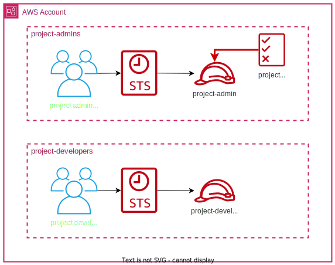

# iam identity center project

Terraform module that creates IAM Identity Center groups and permissions sets for a given project with the following roles:
- project-admin: grants access to an AWS account with `AdministratorAccess` privileges with the imposed permissions boundary policy named `{org}-project-admin-permissions-boundary-policy`.
- project-developer: grants access to an AWS account with `ReadOnlyAccess` privileges. The project's developer permissions can be extended, if necessary, by modifying the inline policy (line 19 in the `permissions_sets_developer.tf` file).

<br>



Important: This module depends on the permissions boundary policies which are created by the following module:
- [iam-permissions-boundary-policies](https://github.com/mateusz-uminski/terraform-aws-modules/tree/main/iam-permissions-boundary-policies)
The above policies must be provisioned on each AWS account before using this module!

This module requires the IAM Identity Center to be enabled. You can accomplish this by following the steps outlined below:
1. Enable IAM Identity Center
2. Change MFA settings to:
- `Every time they sign in (always-on)`
- `Require them to register an MFA device at sign in`
3. Enable `Attributes for access control`
4. Add the following attribute: `ac:project = ${path:enterprise.division}`

List of modules used for sso configuration:
- [iam-identity-center](https://github.com/mateusz-uminski/terraform-aws-modules/tree/main/iam-identity-center)
- [iam-identity-center-project](https://github.com/mateusz-uminski/terraform-aws-modules/tree/main/iam-identity-center-project)
- [iam-permissions-boundary-policies](https://github.com/mateusz-uminski/terraform-aws-modules/tree/main/iam-permissions-boundary-policies)
- [iam-identity-center-users](https://github.com/mateusz-uminski/terraform-aws-modules/tree/main/iam-identity-center-users)


# Example of usage
```terraform
module "iam_identity_center_microlearning" {
  source = "git::https://github.com/mateusz-uminski/terraform-aws-modules//iam-identity-center-project?ref=main"

  # required variables
  org_abbreviated_name = "mcd"
  project_name         = "microlearning"

  aws_accounts = [
    {
      "account_name" = "mcd-nonprod"
      "account_tier" = "nonprod"
      "account_id"   = "111111111111",
    },
    {
      "account_name" = "mcd-prod"
      "account_tier" = "prod"
      "account_id"   = "111111111111",
    }
  ]
}
```
