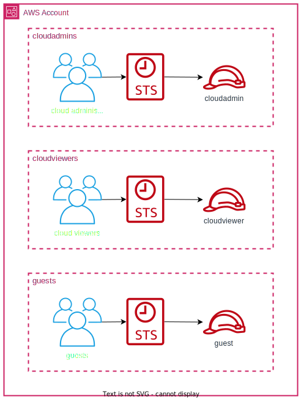

# iam identity center

Terraform module that creates IAM Identity Center groups and permissions sets with the following roles:
- cloudadmin: grants access to an account with `AdministratorAccess` privileges.
- cloudviewer: grants access to an account with `ReadOnlyAccess` privileges.
- guest: allows to grant access to an account to specific individuals with personalized permissions

Example of usage the guest role on the `microcloud-nonprod` account:
```terraform
{
  Effect = "Allow"
  Action = ["sts:AssumeRole"]

  Principal = {
    AWS = ["arn:aws:iam::111111111111:role/aws-reserved/sso.amazonaws.com/AWSReservedSSO_mcd-guest-nonprod_*/<username login>"]
  }
}
```

<br>



This module requires the IAM Identity Center to be enabled. You can accomplish this by following the steps outlined below:
1. Enable IAM Identity Center
2. Change MFA settings to:
- `Every time they sign in (always-on)`
- `Require them to register an MFA device at sign in`
3. Enable `Attributes for access control`
4. Add the following attribute: `ac:project = ${path:enterprise.division}`

List of modules used for sso configuration:
- [iam-identity-center](https://github.com/mateusz-uminski/terraform-aws-modules/tree/main/iam-identity-center)
- [iam-identity-center-project](https://github.com/mateusz-uminski/terraform-aws-modules/tree/main/iam-identity-center-project)
- [iam-permissions-boundary-policies](https://github.com/mateusz-uminski/terraform-aws-modules/tree/main/iam-permissions-boundary-policies)
- [iam-identity-center-users](https://github.com/mateusz-uminski/terraform-aws-modules/tree/main/iam-identity-center-users)


# Example of usage
```terraform
module "iam_identity_center" {
  source = "git::https://github.com/mateusz-uminski/terraform-aws-modules//iam-identity-center?ref=main"

  # required variables
  org_abbreviated_name = "mcd"

  aws_accounts = [
    {
      "account_name" = "mcd-mgmt"
      "account_tier" = "mgmt"
      "account_id"   = "111111111111",
    },
    {
      "account_name" = "mcd-shared"
      "account_tier" = "shared"
      "account_id"   = "111111111111",
    },
    {
      "account_name" = "mcd-nonprod"
      "account_tier" = "nonprod"
      "account_id"   = "111111111111",
    },
    {
      "account_name" = "mcd-prod"
      "account_tier" = "prod"
      "account_id"   = "111111111111",
    }
  ]
}
```
