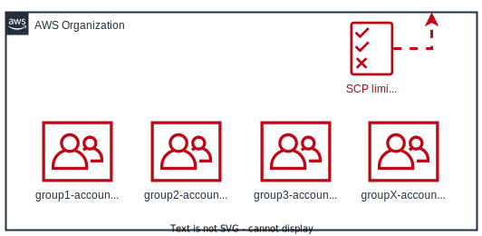

# organization

Terraform module that bootstraps an AWS organization. It creates organizational
units with given prefixes and attaches a SCP policy to the root.
The SCP policy limits access in the organization only to given regions.
<br>



# Usage
```terraform
module "organization" {
  source = "git::https://github.com/mateusz-uminski/terraform-aws-modules//organization?ref=main"

  # required variables
  unit_prefixes     = ["dev", "prod"]
  operating_regions = ["us-east-1"]
}
```
