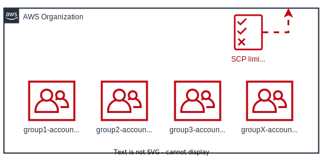

# organization

Terraform module that bootstraps an aws organization. It creates organizational
units with given prefixes and attaches a SCP policy to the root.
The SCP policy limits access in the organization only to given regions.
<br>



# Example of usage
```terraform
module "organization" {
  source = "git::https://github.com/mateusz-uminski/terraform-aws-modules//organization?ref=main"

  # required variables
  organizational_unit_prefixes   = ["nonprod", "prod"]
  organization_operating_regions = ["us-east-1"]
}
```
