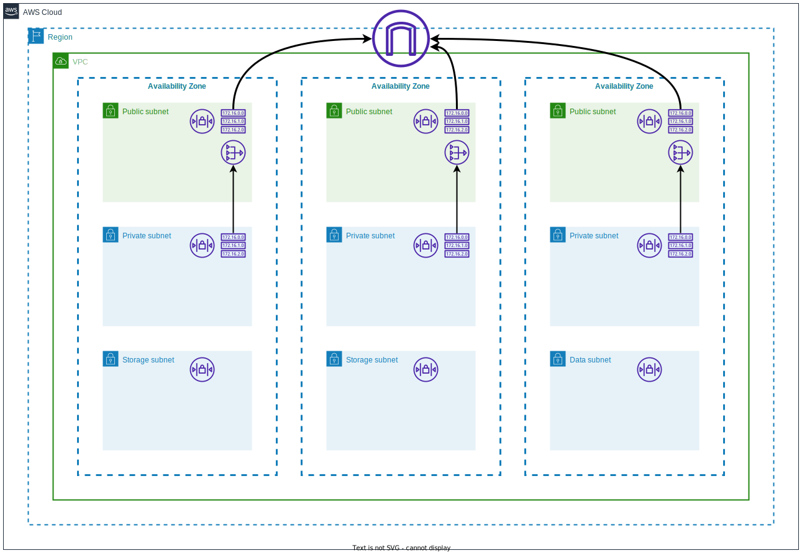

# vpc

Terraform module that creates a vpc with three different types of subnets:
- **public subnets**: both inbound and outbound traffic to the public internet is allowed.
- **private subnets**: only outbound traffic to the public internet and inbound traffic from the vpc (this can be extended using `private_subnets_ingress_nacl`) is allowed.
- **storage subnets**: only outbound traffic to the VPC and only inbound traffic from the private subnets is allowed.

The module also allows
- configuring vpc flow logs by specifying a target S3 bucket,
- connecting to a transit gateway by specifying a transit gateway ARN




# Usage

```terraform
module "vpc" {
  source = "git::https://github.com/mateusz-uminski/terraform-aws-modules//vpc?ref=main"

  # required variables
  org_code     = "org_code"
  project_code = "project_code"
  env_code     = "dev"
  vpc_name     = "main"
  vpc_cidr     = "10.18.0.0/16"

  public_subnets  = ["10.18.0.0/20"]
  private_subnets = ["10.18.16.0/20"]
  storage_subnets = ["10.18.32.0/20"]

  # optional variables
  create_nat_gateway               = false
  vpc_flow_logs_s3_bucket_arn      = "arn:aws:s3:::org_code-project_code-main-vpc-flow-logs-euw1-dev"
  domain_name                      = "euw1.dev.internal.example.com"
  transit_gateway_id               = ""
  transit_gateway_destination_cidr = "0.0.0.0/0"

  private_subnets_ingress_nacl = {
    "100" = "10.18.0.0/16", # main vpc eu-west-1
  }

  tags = {}
}
```
