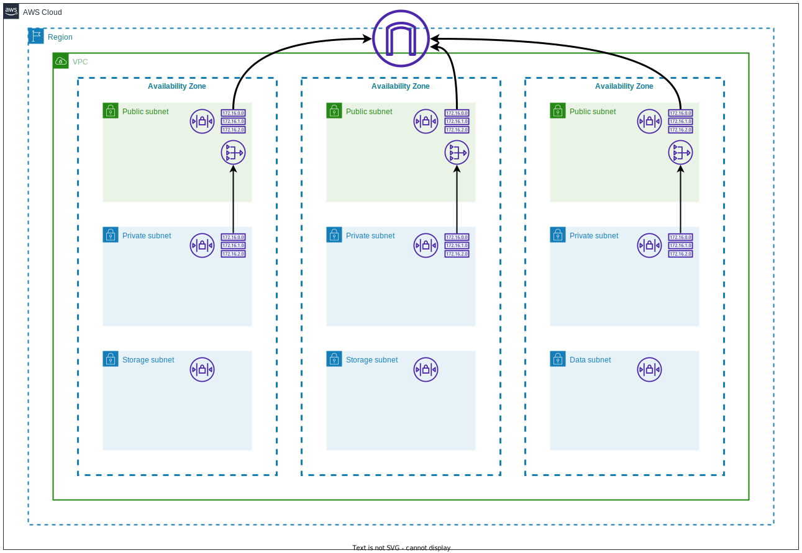

# vpc

Terraform module that creates a vpc with three different types of subnets:
- **public subnets**: both inbound and outbound traffic to the public internet are allowed.
- **private subnets**: each subnet has its own NAT gateway. Outbound traffic to the public internet and only inbound traffic from the VPC is allowed (this can be extended using `private_subnets_ingress_nacl`).
- **storage subnets**: inbound traffic is limited to only come from the private subnets, and outbound traffic is allowed only to the VPC.

The module also allows configuring vpc flow logs by specifying a target S3 bucket.





# Usage
```terraform
module "vpc" {
  source = "git::https://github.com/mateusz-uminski/terraform-aws-modules//vpc?ref=main"

  # required variables
  org_code    = "org"
  project     = "project"
  environment = "dev"
  vpc_name    = "main"
  vpc_cidr    = "10.18.0.0/16"

  public_subnets  = ["10.18.0.0/20", "10.18.16.0/20", "10.18.32.0/20"]
  private_subnets = ["10.18.64.0/20", "10.18.80.0/20", "10.18.96.0/20"]
  storage_subnets = ["10.18.144.0/20", "10.18.160.0/20", "10.18.176.0/20"]

  # optional variables
  vpc_flow_logs_s3_bucket_arn = "arn:aws:s3:::org-project-main-vpc-dev-flow-logs"
  domain_name                 = "euw1.dev.internal.example.com"
  transit_gateway_id          = ""

  private_subnets_ingress_nacl = {
    "100" = "10.18.0.0/16", # main vpc eu-west-1 shared (current)
    "200" = "10.24.0.0/16", # main vpc eu-west-1 nonpprod
    "300" = "10.30.0.0/16", # main vpc eu-west-1 prod
  }
}
```
